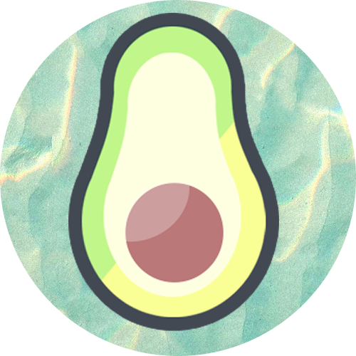

<h1> Bienvenido a mi página de Github </h1>

Avocados Network is a company created to make its web pages with the most modern technology, so that your business works online.

<h3>I'm Pablo and I like programming, especially web dev. These are the technologies that I am using or learning</h3>

